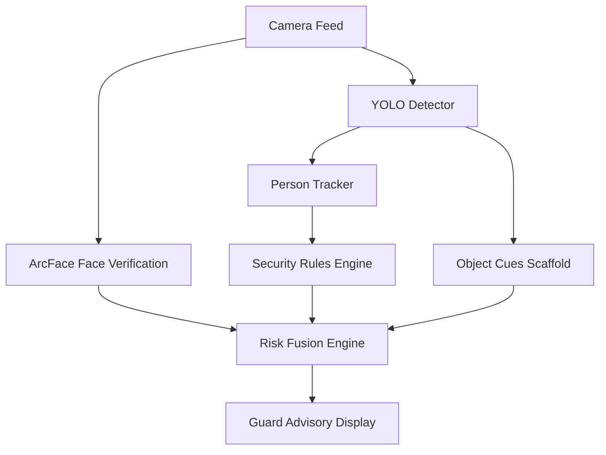

# Research Paper Skeleton — SmartKUET Sentinel

This skeleton provides a publication-ready structure for an academic paper presenting the SmartKUET Sentinel framework.

---

## Title
**SmartKUET Sentinel: Multi-Modal, Explainable, and Privacy-Aware Risk Fusion for Edge-AI Campus Gate Monitoring**

---

## Abstract
*Abstract Draft*:  
Physical security at university entrances requires balancing high-throughput access, identity verification, and privacy preservation. Traditional systems rely either on manual credential inspection or cloud-based facial recognition, introducing latency, single-points-of-failure, and biometric privacy concerns. This paper introduces **SmartKUET Sentinel**, an offline edge-AI framework for campus gate monitoring. Sentinel integrates real-time YOLO object/person detection, frame-rate bounding box tracking, spatial-temporal security rule checks, and local ArcFace face verification. To combine these heterogeneous signals, we present a deterministic, explainable **Multi-Modal Risk Fusion Engine** that evaluates threat levels and generates auditable reasoning traces for security staff. Sentinel runs completely offline on the edge, caching biometrics locally without external cloud dependencies. Experimental results on CPU and GPU configurations demonstrate real-time processing throughput ($\ge 60$ FPS on GPU) and robust rule evaluation, proving the feasibility of privacy-preserving edge security prototypes.

---

## 1. Introduction
* **Context**: Campus gate security challenges at universities like KUET. High traffic, threat of unauthorized entry, and latency bottlenecks of manual checks.
* **Problem**: The privacy risks of cloud facial recognition and the fragility of single-sensor verification (e.g. spoofing a lanyard or card).
* **Proposed Solution**: SmartKUET Sentinel. An edge-AI pipeline combining object detection, track histories, face verification, and risk fusion.
* **Contributions**:
  1. An offline, edge-optimized multi-sensor monitoring pipeline.
  2. A deterministic and explainable Multi-Modal Risk Fusion algorithm.
  3. A privacy-preserving biometric architecture storing data locally.

---

## 2. Related Work
* **Edge-AI & YOLO**: Lightweight object detection models at the network edge.
* **Face Verification Models**: InsightFace (ArcFace) embeddings for fast, localized search.
* **Multi-Modal Threat Assessment**: Sensor fusion in security and gate monitoring.
* **Biometric Privacy & GDPR**: Legal frameworks and local caching designs.

---

## 3. System Architecture & Methodology
Sentinel processes BGR camera frames sequentially:
1. **Detection & Tracking**: YOLOv8 extracts bounding boxes. An IoU-fallback tracker maintains track trajectories to calculate velocity, loitering ages, and ROI gates.
2. **Security Rules evaluation**: Coordinates are filtered through a normalized Gate-Zone ROI. Alert events (loitering, crowding, after-hours) are triggered.
3. **Face Verification**: On-demand ArcFace verifies detected faces against a local gallery, calculating cosine similarity.
4. **Scaffolding Object Cues**: Detects supporting cues (lanyards, ID cards) to adjust the confidence boundaries.

---

## 4. Multi-Modal Risk Fusion Algorithm

We present a deterministic heuristic risk-fusion scoring model designed to combine heterogeneous sensor feeds. Note that this scoring system acts as a heuristic rule-based framework for threat prioritization and is not yet statistically validated against large-scale historical gate datasets.

### A. Mathematical Formulation
Let $S_{base}$ be the base score determined by face verification status:
$$S_{base} = \begin{cases} 
15 & \text{Face status} = \text{KNOWN} \\ 
45 & \text{Face status} = \text{LOW\_CONFIDENCE} \\ 
70 & \text{Face status} = \text{UNKNOWN} \\ 
30 & \text{Face status} = \text{NOT\_AVAILABLE} 
\end{cases}$$

Let $A_{aggravate}$ be the score adjustments from temporal-spatial triggers:
* **After-Hours ($T_{after}$)**: If face is UNKNOWN, $S \leftarrow 90$; else $S \leftarrow S_{base} + 20$.
* **Motionless ($M_{person}$)**: If after-hours, $S \leftarrow \max(S, 90)$; else $S \leftarrow \max(S, 75)$.
* **Camera Offline ($C_{offline}$)**: $S \leftarrow \max(S, 75)$.
* **Gate ROI Presence ($G_{roi}$)**: If face is UNKNOWN, $S \leftarrow \max(S, 75)$.
* **Critical Rule Alerts ($R_{alert}$)**: If after-hours, $S \leftarrow \max(S, 95)$; else $S \leftarrow \max(S, 80)$.

Let $M_{mitigate}$ be the sum of present object cues ($C_{cue} \in \{\text{lanyard}, \text{id\_card}, \text{visitor\_badge}\}$):
$$M_{mitigate} = \sum 5 \cdot \mathbb{I}(C_{cue} \text{ detected})$$

The raw score is reduced by mitigations, subject to safety floors:
$$S_{fused} = \max(S_{base} + A_{aggravate} - M_{mitigate}, \text{Floor}_{face})$$
Where:
$$\text{Floor}_{face} = \begin{cases} 
50 & \text{Face status} = \text{UNKNOWN} \\ 
30 & \text{Face status} = \text{LOW\_CONFIDENCE} \\ 
0 & \text{Otherwise} 
\end{cases}$$

---

## 5. Experimental Setup & Results
* **Hardware Setup**: CPU (Intel Core i7) and GPU (NVIDIA RTX 3050 Laptop GPU, 4 GB VRAM).
* **Throughput Benchmarks**: Measured frame rate (FPS) and average inference latency (ms).
* **Correctness Validation**: 95 test case verification report.
* **Results Placeholders**: To be filled after benchmark runs and scenario-based evaluation.
  * Table 1: FPS and latency across CPU/GPU models.
  * Table 2: Multi-Modal evaluation scores for target threat scenarios.

---

## 6. Discussion: Privacy & Ethics
* **Offline Caching**: Face vectors stored locally as encrypted `.npy` files. No external queries.
* **Human-in-the-Loop Constraint**: Explainable reasoning list is supplied to the guard. The system provides advisory recommendations only and cannot lock or unlock doors automatically.

---

## 7. Limitations & Future Work
* Bounding box tracking is temporary and lacks multi-camera re-identification.
* Light constraints and pose variations affect ArcFace matching similarity.
* Future work: Fine-tuning a unified YOLOv8 model for multi-task student cue detection.

---

## 8. Conclusion
SmartKUET Sentinel successfully demonstrates an explainable, privacy-aware, local-only risk fusion approach for edge deployment at campus gates, proving academic suitability for research monitoring.
