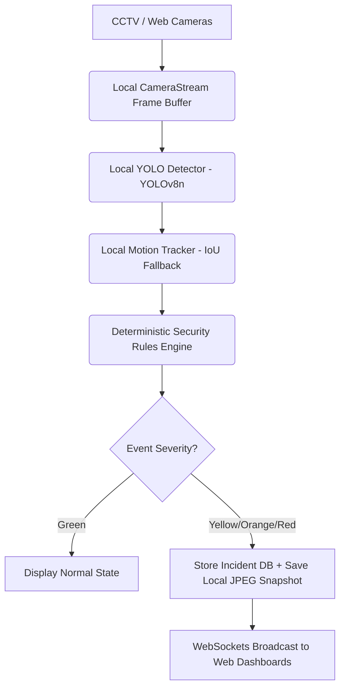

# SmartKUET Sentinel: Offline Edge-AI Campus Security & Exam Integrity Assistant

This document outlines the proposal details and innovation pitch for the SmartKUET Sentinel submission.

## Project Title
**SmartKUET Sentinel**: Offline Edge-AI Campus Security & Exam Integrity Assistant

## Problem Statement
University campus checkpoints (like the KUET Main Gate) and exam halls require continuous monitoring to ensure safety and integrity. Conventional CCTV systems are purely passive: they record events for retrospective analysis but fail to provide real-time proactive warnings. However, existing automated solutions rely on cloud-connected APIs, introducing:
1. **High Latency**: Ineffective for immediate gate intercepts.
2. **Privacy Risks**: Uploading student faces or video streams to third-party cloud servers.
3. **Connectivity Dependency**: Entirely fails if local internet goes down.

## Proposed Solution
SmartKUET Sentinel is an **offline-first Edge-AI** monitoring assistant designed specifically for deployment on KUET campus servers or laptops. By performing all deep learning inference locally, the system monitors streams, tracks movements, and flags security issues in real-time without sending any data off campus.

## How It Works
1. **Video Ingestion**: Reads local webcam index, IP RTSP streams, or local MP4 files frame-by-frame.
2. **Object Detection (YOLO)**: Utilizes a lightweight, CPU-efficient `yolov8n` model running locally to identify persons, phones, and vehicles.
3. **Motion Tracking**: Assigns short-lived, temporary track IDs to trace movement paths across consecutive frames.
4. **Security Rules Engine**: A deterministic state machine checks signals (crowding, loitering, after-hours movement, phone visibility) to raise alarm alerts.
5. **Real-time Broadcast**: Communicates status instantly to guard and admin monitors via HTML5 WebSockets.

## Current Prototype Features (Working)
* **Real-time Offline YOLO Inference**: Detects persons, phones, and vehicles locally.
* **Temporary Motion Tracking**: Traces paths using localized tracking state without permanent profiling.
* **Deterministic Rules Engine**: Fires color-coded alerts (Green, Yellow, Orange, Red) and suggests clear guard instructions.
* **Evidence Snapshot System**: Automatically captures JPEG proof of security incidents to local storage.
* **Central Web Dashboard**: Clean monitor view of live feeds, security states, tracking lists, and system diagnostics.
* **Guard Interface**: Mobile-first, responsive screen with enlarged action selectors and disclaimers.
* **Examiner Mock Screen**: UI highlighting seat suspicion logs and integrity alert tables.

## Demo Validation Summary Result
The pipeline has been tuned and validated locally using sample footage:
* **Average Inference Latency**: ~56.92 ms per frame on CPU (excluding model warmup).
* **Approximate Pipeline Frame Rate**: ~34.58 FPS.
* **Success Criteria**: 35 unit/integration tests successfully verified.

## Human-in-the-Loop Safety
* **Decision Support, Not Automation**: The system does not lock gates, deny entry, or penalize students automatically. It acts solely as an assistant.
* **Final Authority**: The human guard (at the gate) or examiner (in the hall) retains total control and makes the final decision.
* **No Face Recognition**: The system tracks temporary motion coordinates only, protecting student identities.

## Cost Effectiveness
* Runs on standard consumer-grade computer hardware (e.g. entry-level laptops).
* Zero recurring cloud costs or license fees.
* Entirely open-source stack (FastAPI, OpenCV, PyTorch, Ultralytics YOLO).

## KUET Deployment Plan
1. **Gate Checkpoint**: Deploy a local mini-PC connected to the main gate IP camera to alert guards of crowding or vehicles blocking access.
2. **Exam Invigilation**: Use room cameras to alert invigilators if candidates leave their seats or pull out devices.
3. **Offline Infrastructure**: Run a local campus LAN server for dashboard access without external web endpoints.

## Current Limitations & Future Work
* **No Face Identification**: Currently tracks temporary IDs only. Future work includes a localized student enrollment DB for face-verification lookup after initial consent approval.
* **Hardware Acceleration**: Currently runs on CPU fallback. Future production builds will run with CUDA support on laptops with discrete GPUs (like NVIDIA RTX 350/4050).
* **Cheating Behavior Classification**: Invigilation is currently mock-only. Future work involves training a localized spatial-temporal classifier to detect suspicious postures.
