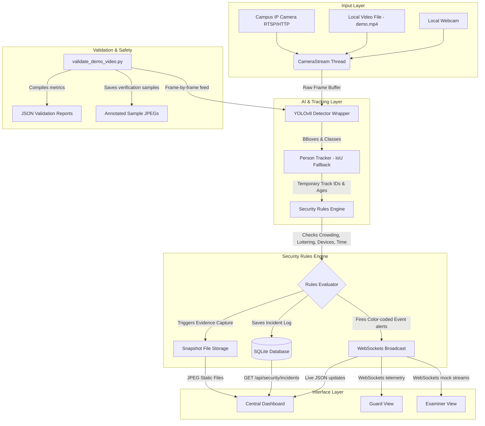

# SmartKUET Sentinel - Technical Architecture

This document describes the technical layers and system data flow of the SmartKUET Sentinel offline Edge-AI pipeline.

---

## Architecture Flow Diagram

---

## Architectural Layers

### 1. Input Layer
*   **Module**: `core/camera.py` (`CameraStream` class)
*   **Role**: Spawns a background thread utilizing OpenCV to continually ingest frames from webcams, local files (`sample_videos/demo.mp4`), or IP camera URLs. Handles camera reconnection fallbacks and loops local videos.

### 2. AI Layer
*   **Module**: `core/detector.py` (`YOLODetector` class)
*   **Role**: Performs local object detection utilizing a lazy-loaded `yolov8n.pt` model. Identifies bounding boxes, class names, and confidence scores for person, phone, and vehicle classes.

### 3. Tracking Layer
*   **Module**: `core/tracker.py` (`PersonTracker` class)
*   **Role**: Performs temporary identity tracking using an intersection-over-union (IoU) overlap backend. It does **not** identify candidates or build permanent profile data; it only monitors active tracks and counts unique targets seen.

### 4. Rule Layer
*   **Module**: `core/security_rules.py` (`SecurityRulesEngine` class)
*   **Role**: Implements a deterministic rules-based state machine. Assesses signals like crowding count, loitering age, after-hours presence, device cues, or camera status to return recommended instructions and severity levels (Green, Yellow, Orange, Red).

### 5. Storage Layer
*   **Module**: `core/database.py` (`Database` class)
*   **Role**: Stores persistent incidents locally in `data/smartkuet.db` using SQLite. Incidents store severity, instruction recommendations, created times, and local image file paths. Snapshot JPEGs are written to `snapshots/evidence/`.

### 6. Interface Layer
*   **Web Files**: HTML, local CSS, vanilla JS inside `dashboard/`
*   **Routing API**: `api/main.py`
*   **Role**: Broadcasts real-time events to dashboards via FastAPI WebSockets. Serves responsive dashboard pages to campus clients.

### 7. Validation Layer
*   **Scripts**: `scripts/validate_demo_video.py`
*   **Role**: Benchmarks the pipeline frame-by-frame, writing CPU latencies, object averages, and rules severity outputs to local files under `runs/benchmarks/`.

### 8. Safety & Compliance Layer
*   **Human-in-the-Loop design**: Prohibits automatic gate control or student punishment. The AI recommends cues, and the campus administrator/guard makes final decisions.
*   **Data Sovereignty**: Restricts all logs, databases, snapshots, and model weights to the local project drive. No cloud connections or remote APIs are permitted.
